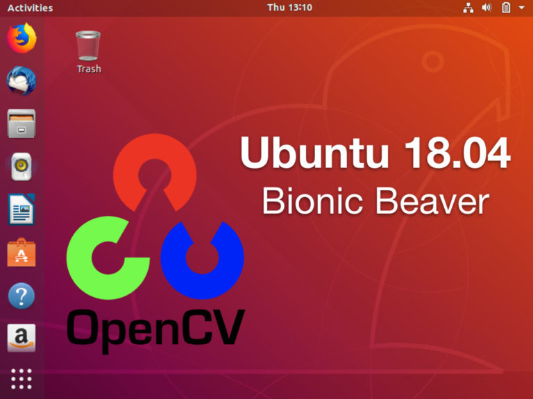

Settting up environment
=======================

This part of the documentation covers the installation of development
environment for python and opencv. This document is intended for Linux users.

Python development
------------------
If you installed Ubuntu 18.04, Python 2 and Python 3 are installed by default.

Pip Installation
~~~~~~~~~~~~~~~~
To install **Pip**, simply run this simple command in your terminal of choice::

    $ sudo apt -y install python-pip
    $ sudo apt -y install python3-venv python3-pip
    $ python3 -m pip install -U pip

After **pip** installed, please restart the os in order to make sure that
pip work properly.

Then install **virtualenv** using a following command::

    $ python3 -m pip install virtualenv

Python Package Download
~~~~~~~~~~~~~~~~~~~~~~~
You can download python packages on computer connected to internet::

    $ mkdir -p ~/.mypypi/downloads
    $ cd ~/.mypypi/downloads
    $ pip download <package_name>

Or, download the package without cache::

    $ pip --no-cache-dir download <package_name>

And download python packages recursively::

    $ pip --no-cache-dir download -r requirements.txt

**pip download** command  will also make sure all dependencies are
also downloaded.

Install Downloaded Python Package
~~~~~~~~~~~~~~~~~~~~~~~~~~~~~~~~~
After that, you can install packages on the offline computer into
our isolated environment::

    $ virtualenv ~/.virtualenvs/pycv
    $ source ~/.virtualenvs/pycv/bin/activate
    $ pip install --no-index --find-links=file:///home/dev/.mypypi/downloads <package_name>
    $ pip install --no-index --find-links=file:///home/dev/.mypypi/downloads -r requirements.txt

Setting up OpenCV development environment
-----------------------------------------
You can see how to install OpenCV on Ubuntu at
`here <https://www.pyimagesearch.com/2018/05/28/ubuntu-18-04-how-to-install-opencv/>`_.

Install OpenCV dependencies on Ubuntu
~~~~~~~~~~~~~~~~~~~~~~~~~~~~~~~~~~~~~

We need to refresh/upgrade the pre-installed packages/libraries
with the apt-get package manager::

    $ sudo apt-get update
    $ sudo apt-get upgrade

Followed by installing developer tools::

    $ sudo apt-get install build-essential cmake unzip pkg-config

Next, let’s install a handful of image and video I/O libraries::

    $ sudo apt-get install libjpeg-dev libpng-dev libtiff-dev
    $ sudo apt-get install libavcodec-dev libavformat-dev libswscale-dev libv4l-dev
    $ sudo apt-get install libxvidcore-dev libx264-dev

From there, let’s install GTK for our GUI backend::

    $ sudo apt-get install libgtk-3-dev

Followed by installing two packages which contain mathematical
optimizations for OpenCV::

    $ sudo apt-get install libatlas-base-dev gfortran

And finally, let’s install the Python 3 development headers::

    $ sudo apt-get install python3-dev

Download the official OpenCV source
~~~~~~~~~~~~~~~~~~~~~~~~~~~~~~~~~~~
Let’s download the official OpenCV release using **wget**::

    $ cd ~/Packages/opencv
    $ wget -O opencv.zip https://github.com/opencv/opencv/archive/3.4.9.zip
    $ wget -O opencv_contrib.zip https://github.com/opencv/opencv_contrib/archive/3.4.9.zip

Now, let’s unzip the archives::

    $ unzip opencv.zip
    $ unzip opencv_contrib.zip

Now let’s go ahead and rename the directories::

    $ mv opencv-3.4.9 opencv
    $ mv opencv_contrib-3.4.9 opencv_contrib

Configure your Python 3 environment
~~~~~~~~~~~~~~~~~~~~~~~~~~~~~~~~~~~
Creating a virtual environment to hold OpenCV and additional packages::

    $ cd ~/.virtualenvs
    $ virtualenvs pycv
    $ pip install numpy

Configure and compile OpenCV
~~~~~~~~~~~~~~~~~~~~~~~~~~~~

Let’s set up our OpenCV build using **cmake**::

    $ cd ~/Packages/opencv/opencv
    $ mkdir build
    $ cd build
    $ cmake -D CMAKE_BUILD_TYPE=RELEASE \
        -D CMAKE_INSTALL_PREFIX=/usr/local \
        -D WITH_CUDA=OFF \
        -D INSTALL_PYTHON_EXAMPLES=ON \
        -D OPENCV_EXTRA_MODULES_PATH=/path/to/opencv_contrib \
        -D OPENCV_ENABLE_NONFREE=ON \
        -D BUILD_EXAMPLES=ON ..
    $ make -j4
    $ sudo make install
    $ sudo ldconfig

How to use OpenCV in isolated environment
~~~~~~~~~~~~~~~~~~~~~~~~~~~~~~~~~~~~~~~~~
Python 3 binding for OpenCV should reside in the following folder::

    $ ls /usr/local/lib/python3.6/site-packages/cv2/python-3.6
    $ cv2.cpython-36m-x86_64-linux-gnu.so

Rename it to simply **cv2.so**, sym-link our OpenCV **cv2.so**
bindings into our virtual environment::

    $ sudo mv cv2.cpython-36m-x86_64-linux-gnu.so cv2.so
    $ cd ~/.virtualenvs/pycv/lib/python3.6/site-packages
    $ ln -s /usr/local/lib/python3.6/site-packages/cv2/python-3.6/cv2.so cv2.so

Setting up deep learning development environment
------------------------------------------------
Installing Keras RetinaNet
~~~~~~~~~~~~~~~~~~~~~~~~~~
I would therefore highly suggest that you create a new Python virtual
environment (named retinanet ) for the RetinaNet install::

    $ virtualenv retinanet -p python3

Regardless of whether you choose to use an existing or
new Python virtual environment,
the next step is to install the associated dependencies::

    $ pip install numpy scipy h5py
    $ pip install scikit-learn Pillow imutils
    $ pip install beautifulsoup4
    $ pip install tensorflow-gpu
    $ pip install keras

We now need to sym-link our OpenCV cv2  bindings into our Python
virtual environment. Use the following commands to clone down the
Keras RetinaNet repository and install it::

    $ git clone https://github.com/fizyr/keras-retinanet
    $ cd keras-retinanet
    $ git checkout 42068ef9e406602d92a1afe2ee7d470f7e9860df
    $ python setup.py install